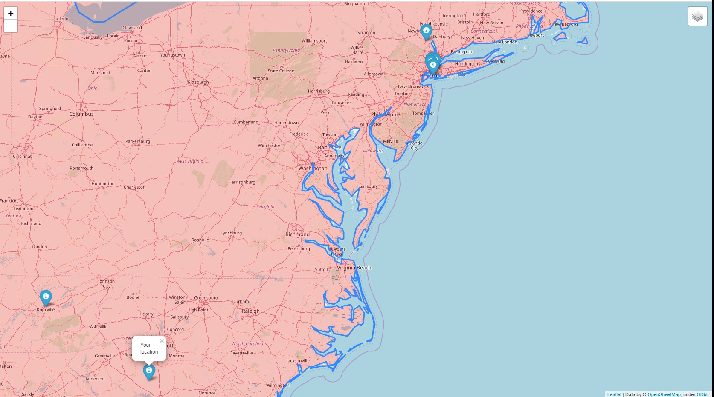

# Map generator

## Project description
Project contains two modules:
1. main.py
2. locations.py

First module creates a map. On the map you can see:
* your location
* countries' population(as colors)
* ten nearest locations, where films were filmed in selected year

Second module works with data in order to optimise main module's work. It creates folder
'location' with files named 'location_{year}.txt', in which you can see films only for 
the year in the name of the file. This allows to create folder only 1 time, because this
process requires a lot of time. 

## Map
Map is created as HTML file. It has following structure:
1. head
   * scrypt
   * style
2. body
   * div
3. scrypt

## Result
Map allows a user to see nearest film filming places by the year he entered. He can also
see population of the country, if needed. 

## Example
````
 python main.py
 
 Please enter a year you would like to have a map for: 2017
 
 Please enter your location (format: lat, long): 34.4016521, -81.2642602
 
 Map is generating...
 
 Please wait...
 
 Finished. Please have look at the map map_2017.html
````


